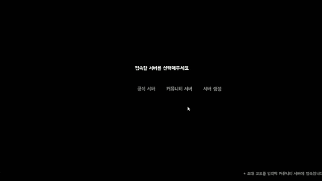
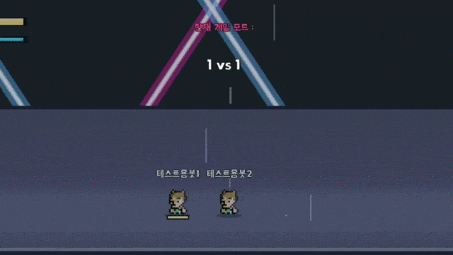
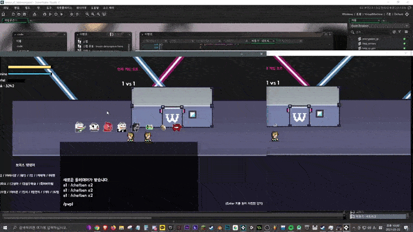

  
# Arena-of-woowakgood

 
  

  
 

우왁굳 팬게임

철권처럼 대전하는 PVP게임으로

1 vs 1로도 즐길수 있고 1 vs 4 로도 즐길수 있음

왁굳형한테 보냈지만 너무 많은 팬치들로 인해 서버가 터져버려서 광탈한 게임

테스트 진행할 당시엔 15명 정도로만 테스트했는데 당시에 테스터들이랑 재미지게 게임 했음

  

#### - 총 다운로드 수

 

#### - 게임 다운로드 

  

### ▼ 미리 보기

#

### ▼ 게임 트레일러

https://youtu.be/dbzp09Ly1CY

#

코드 관련 설명글 (click)

---------------------------------

초대 코드 시스템 (초대 코드를 통해 상대 서버로 접속하는 기능)

-------------

서버 오픈한 사람쪽에서 초대코드를 게임 내에서 발급한뒤에,

들어오는 사람한테 전해주고, 그 코드를 입력해서 들어오는 방식

#

멀티 플레이 시스템

-------------

이모티콘을 보내거나, 채팅을 보내거나, 플레이어를 서버에서 추방시키거나 채팅 금지 시키는 등등...

부가적인 기능이 달린 멀티플레이 시스템

---------------------------------

개발 일지 (모든 개발일지는 아니고 일부만)

---------------------------------

https://cafe.naver.com/steamindiegame/3113686

https://cafe.naver.com/steamindiegame/3143541

---------------------------------
